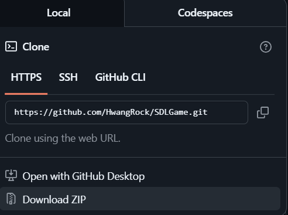
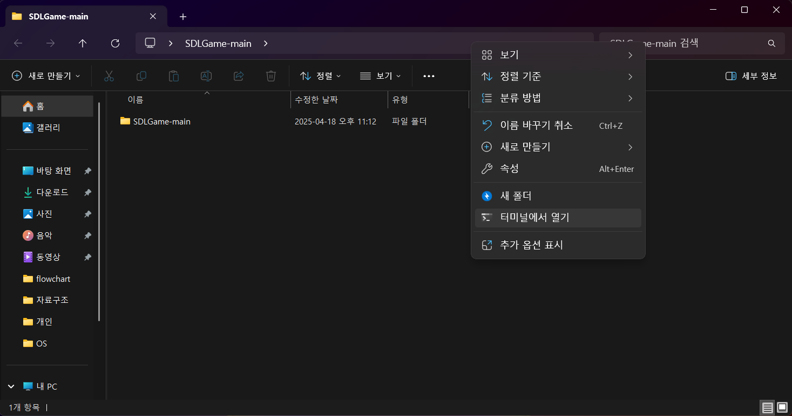
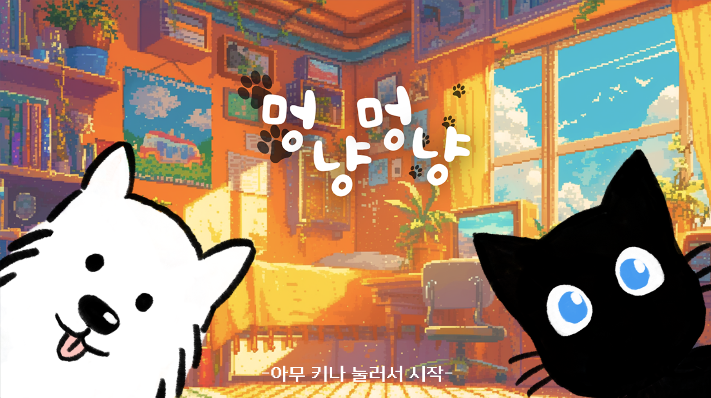
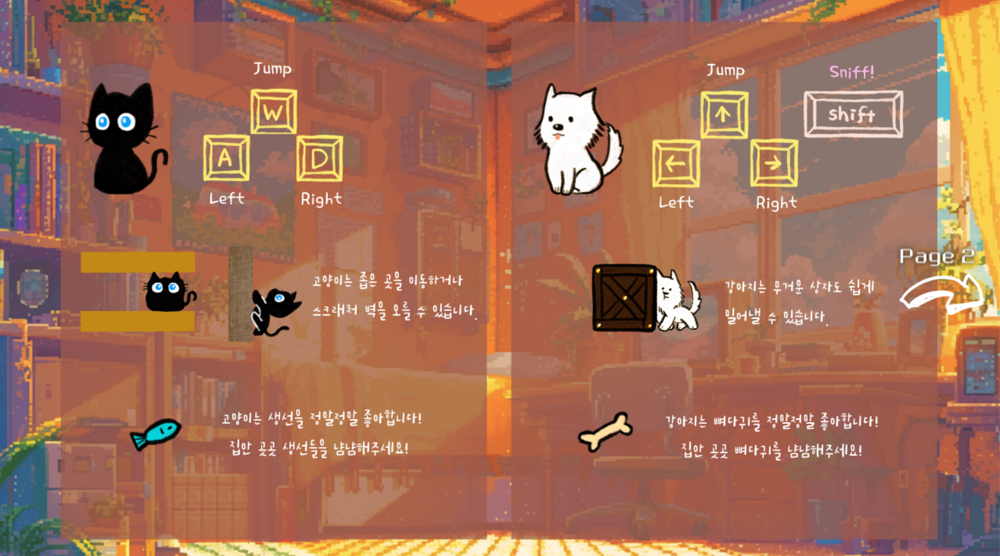
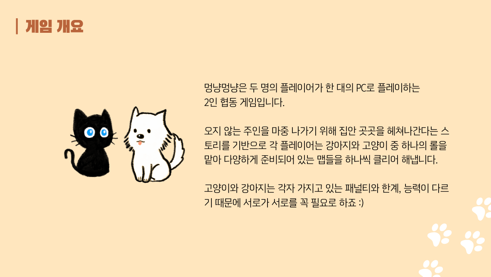
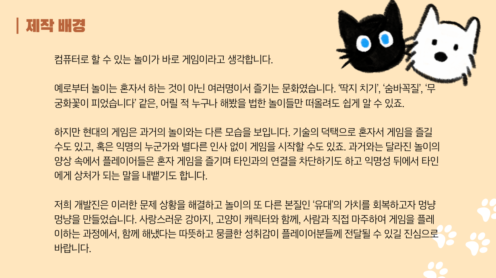

# 멍냥멍냥

2명의 사람이 강아지와 고양이를 플레이해서 방에 있는 장애물을 피해서 방을 탈출하는 게임입니다.

## 실행방법
1. 압축파일을 받아서 압축을 풀어줍니다.

2. 압축풀고 루트 디렉토리에서 CMD로 들어가줍니다.

3. 다음의 명령어를 입력해서 게임을 실행합니다.  
```powershell
cd SDLGame-main\SDLGameProject\x64\Release
.\SDLGameProject.exe
```

## 시작화면

## 설명서


## 맵

## 이 게임은 무엇인가요?

## 이 게임의 제작 배경은 뭔가요?

